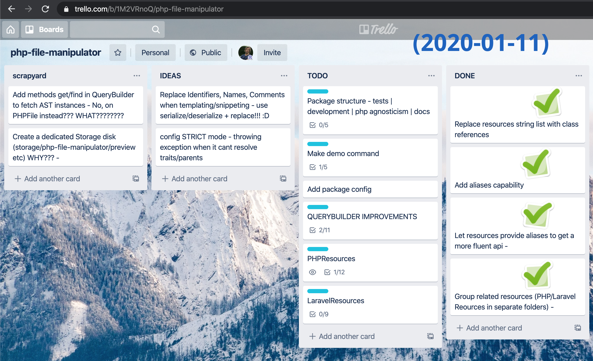

# ```PHPFile::manipulator```(:fire::fire::fire:);


[](https://packagist.org/packages/ajthinking/php-file-manipulator)
[](https://packagist.org/packages/ajthinking/php-file-manipulator)


Programatically manipulate `PHP` / `Laravel` files on disk with an intuiutive, fluent API. Features include *File-* and *Code/AST* QueryBuilders, an inline PHP Template engine and categorization of read/write operations in `Resource` endpoints.


## Contents
  * [Installation](#installation)
  * [Usage](#usage)
    + [Quick start examples](#quick-start-examples)    
    + [Build your own templates](#build-your-own-templates)
    + [Querying the Abstract Syntax Tree](#querying-the-abstract-syntax-tree)
    + [LaravelFile available methods](#laravelfile-available-methods)    
    + [Gotchas](#gotchas)
  * [Contributing](#contributing)
    + [Development installation](#development-installation)
    + [Roadmap](#roadmap)  
  * [License](#license)
  * [Acknowledgements](#acknowledgements)
  * [Like this package?](#like-this-package-)


## Installation
```
composer require ajthinking/php-file-manipulator
php artisan vendor:publish --provider="PHPFileManipulator\ServiceProvider"
```


## Usage


### Quick start examples 
```php
use PHPFile;
use LaravelFile;

// find files with the query builder
PHPFile::in('database/migrations')
    ->where('classExtends', 'Migration')
  	->andWhere('className', 'like', 'Create')
    ->get()
    ->each(function($file) {
        // Do something
        $file->addUses(['Database\CustomMigration'])
          ->classExtends('Database\CustomMigration')
          ->save();
    });

// add relationship methods
LaravelFile::load('app/User.php')
    ->hasMany(['App\Car'])
    ->hasOne(['App\Life'])
    ->belongsTo(['App\Wife'])
  	->classMethodNames()

// move User.php to a Models directory
PHPFile::load('app/User.php')
    ->namespace('App\Models')
    ->move('app/Models/User.php')

// install a package trait
PHPFile::load('app/User.php')
    ->addUseStatements('Package\Tool')
    ->addTraitUseStatement('Tool')
    ->save()

// add a route
LaravelFile::load('routes/web.php')
    ->addRoute('dummy', 'Controller@method')
    ->save()
    
// debug will write result relative to storage/.debug
LaravelFile::load('app/User.php')
    ->setClassName('Mistake')
    ->debug()

// add items to protected properties
LaravelFile::load('app/User.php')
    ->add()->fillable('message')
    ->add()->casts(['is_admin' => 'boolean'])
    ->add()->hidden('secret')    

// create new files from templates
LaravelFile::model('Beer')
    ->save()
LaravelFile::controller('BeerController')
    ->save()

// many in one go
LaravelFile::create('Beer', ['model', 'controller', 'migration'])
```

### Template engine
Let's make a snippet for a method we want to insert. Start by creating a file `storage/php-file-manipulator/snippets/my-stuff.php` like shown below. In the file, we put our template code including any encapsuling constructs (in our case we will have to put a class since methods only exists inside classes). Name anything you want to be configurable with a handle for instance `'___TARGET_CLASS___'`. Even your snippet name itself may be a handle as long as it is unique.

```php
<?php

/**
 * Optionally use FAKE names to silence IDE warnings
 */
use PHPFileManipulator\Support\FakeName; 
use PHPFileManipulator\Support\FakeName as ANY;
use PHPFileManipulator\Support\FakeName as ___TARGET_CLASS___;

/**
 * This is just a placeholder class where we can add our snippets
 */
class _ extends FakeName
{
    /**
    * ___DOC_BLOCK___
    */
    public function mySpecialMethod($arg)
    {
        $want = abs($arg);
        return $this->doSomethingWith(___TARGET_CLASS___::class, 'my template')
            ->use(ANY::thing(new static('you' . $want)));
    }    
}
```

Your snippet is then instantly available anywhere in your code:
```php
use PHPFileManipulator\Support\Snippet;

// Get the snippet
Snippet::mySpecialMethod()

// Pass an array of replacement pairs to replace any handles:
Snippet::mySpecialMethod([
    '___DOC_BLOCK___' => 'Inserted with php-file-manipulator :)',
    '___TARGET_CLASS___' => 'App\Rocket'
]);

// Integrated example
PHPFile::load('app/User.php')
    ->addMethod(
        Snippet::mySpecialMethod([
            // replacement pairs ...
        ])
    )->save();
````

> :information_source: The `Snippet` class currently only supports templates on *class methods*.


### Querying the Abstract Syntax Tree
As seen in the previous examples we can query and manipulate nodes with simple or primitive values, such as *strings* and *arrays*. However, if we want to perform custom or more in dept queries we must use the `ASTQueryBuilder`.

Example: how can we fetch explicit column names in a migration file?

```php
LaravelFile::load('database/migrations/2014_10_12_000000_create_users_table.php')
    ->astQuery() // get a ASTQueryBuilder

    ->method()
        ->named('up')
    ->staticCall()
        ->where('class', 'Schema')
        ->named('create')
    ->args
    ->closure()
    ->stmts
    ->methodCall()
        ->where('var->name', 'table')
    ->args
	->value
	->value
	->get(); // exit ASTQueryBuilder, get a Collection        
```


The ASTQueryBuilder examines all possible paths and automatically terminates those that cant complete the query:


* Three kinds of methods are provided (hinted with indentation in the code example)
    * Traversing (`methods`,`staticCalls`,`firstArg` ...)
    * Filtering (`named`, `whereClass` ...)
    * Resolving (`getValue`)
* The ASTQueryBuilder relies entirely on [nikic/php-parser](https://github.com/nikic/php-parser). To understand this syntax better tinker with `dd($file->ast()`. 

### LaravelFile available methods
To list all the available methods A-Z on `LaravelFile`, run: 
```
php artisan file:api
```


To group methods by `EndpointProvider` use the `--group` flag:
```
php artisan file:api --group
```

Use the `--provider` flag to only view methods from a specific `EndpointProvider`, for instance `IO`:
```
php artisan file:api --provider=IO
```

### Gotchas

> If a file can't be parsed, a `FileParseError` will be thrown.

> To see *all* offending files run `php artisan file:errors`.

> :warning: This package assumes code follows guidellines and conventions from [PSR](https://www.php-fig.org/psr/) and [Laravel](https://laravel.com/docs). Examples: use no more than one class and namespace per file, refrain from multiple property declarations in same line, avoid group use statements etc.

> :warning: Files to be processed must have encoding UTF-8

## Contributing
### Development installation
The test suite requires that you are inside laravel application
```bash
laravel new host
cd host
git clone git@github.com:ajthinking/php-file-manipulator.git packages/Ajthinking/PHPFileManipulator
```
Add this to the host projects `composer.json`
```json
    "repositories": [
        {
            "type": "path",
            "url": "/PATH/TO/PROJECTS/host/packages/Ajthinking/PHPFileManipulator"
        }
    ],
```
Then,
```bash
composer require ajthinking/php-file-manipulator @dev
php artisan vendor:publish --provider="PHPFileManipulator\ServiceProvider"
```
Finally in host root run
```bash
vendor/phpunit/phpunit/phpunit packages/Ajthinking/PHPFileManipulator/tests
```

### Roadmap
PRs and issues are welcome. Have a look at the [Trello board](https://trello.com/b/1M2VRnoQ/php-file-manipulator) for planned features.

<a href="https://trello.com/b/1M2VRnoQ/php-file-manipulator">
    
</a>

## License
MIT


## Acknowledgements
* Built with [nikic/php-parser](https://github.com/nikic/php-parser)
* PSR Printing fixes borrowed from [tcopestake/PHP-Parser-PSR-2-pretty-printer](https://github.com/tcopestake/PHP-Parser-PSR-2-pretty-printer)


## Like this package?
<a href="https://github.com/ajthinking/php-file-manipulator/stargazers" >Star it :star: </a>

[Say hi: @ajthinking :gem:](https://twitter.com/ajthinking)

[Github Sponsors :octocat::heart:](https://github.com/sponsors/ajthinking)
